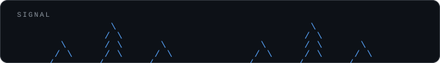
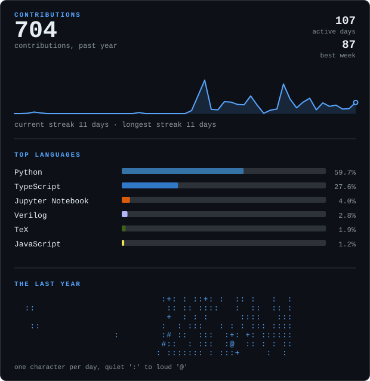

<samp><b>NANDA SIDDHARDHA</b></samp>

[email](mailto:sn3199@columbia.edu) &nbsp;·&nbsp;
[linkedin](https://www.linkedin.com/in/nanda-siddhardha/) &nbsp;·&nbsp;
[medium](https://medium.com/@nandasiddhardha) &nbsp;·&nbsp;
[researchgate](https://researchgate.net/profile/Nanda-Siddhardha)

> Biomedical intelligence systems for real clinical use. 
> Master's in Biomedical Engineering.

My work centers on biomedical signal intelligence, diagnostic modeling, and
production-ready health-tech workflows. Cybersecurity was a strong
undergraduate hobby and still informs how I think about reliability, privacy,
and resilient deployment.

<samp>python &nbsp; pytorch &nbsp; typescript &nbsp; monai &nbsp; nnU-Net &nbsp; verilog &nbsp; docker &nbsp; git</samp>

**Research philosophy**

- Build beyond prototypes: prioritize deployability from day one.
- Keep models clinically interpretable, not just statistically strong.
- Design for reliability, reproducibility, and patient-context constraints.

**Current directions**

- Biomedical signal processing for diagnostics and monitoring
- Machine learning pipelines for healthcare prediction tasks
- Embedded and VLSI-assisted sensing architectures
- Reproducible health-tech experimentation and evaluation

**Academic trajectory**

- Now &nbsp;— advancing biomedical ML workflows for practical clinical utility
- Next &nbsp;— translating validated prototypes into robust healthcare tools

**Pulse**

Every graphic here is generated, not embedded from a third-party service.
The EKG trace up top is drawn once by
[`scripts/make_signal.py`](scripts/make_signal.py); the card above is drawn
daily by [`scripts/generate_stats.py`](scripts/generate_stats.py), which
queries the GitHub GraphQL API directly, run by
[a scheduled Action](.github/workflows/stats.yml) that commits only what
changed. Nothing here can rate-limit or go dark because nothing loads from
anyone else's server.
